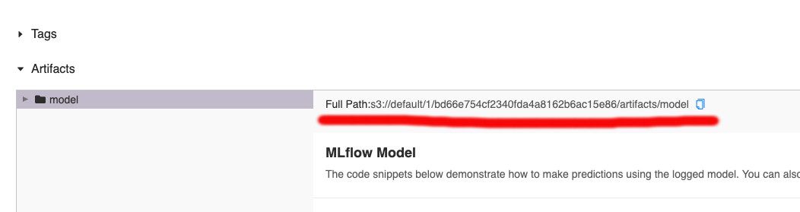
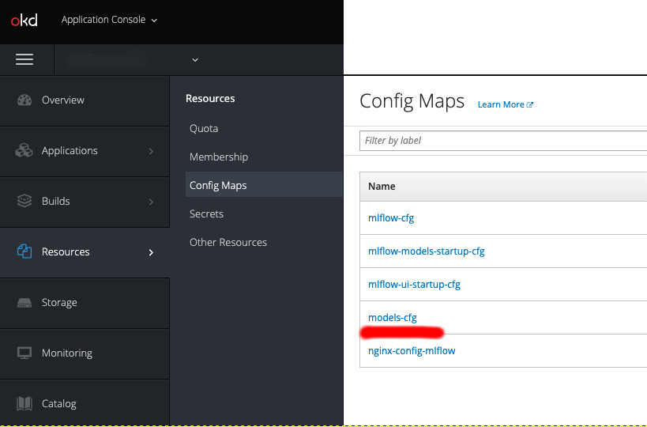
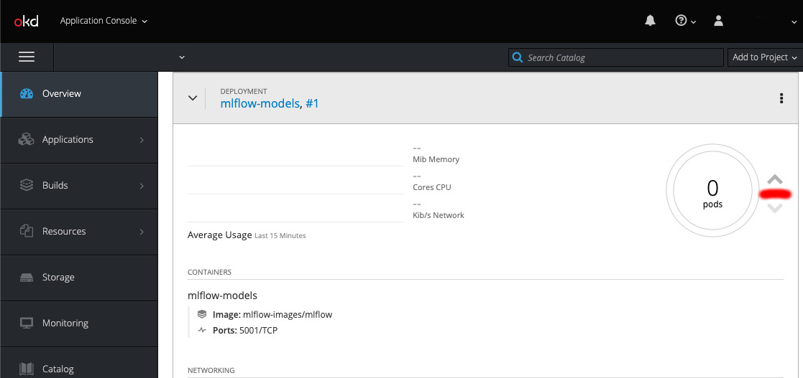
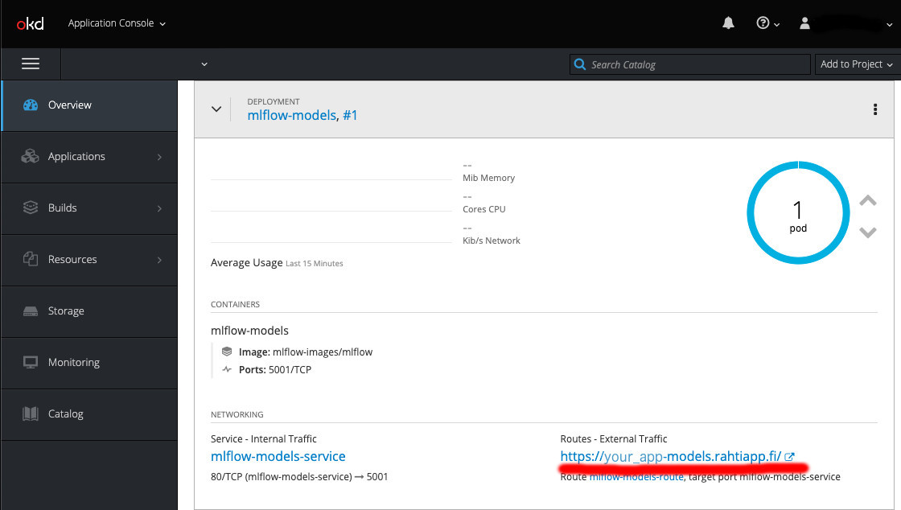

# MLflow user guide

## MLflow Models
MLflow Models is used to serve tracked model for inference. In the template, Models is run in own pod, so inference doesn't affect Tracking performance. 
Currently, template support serving one model at time.
### How to set up
First you have to have some training runs recorded to Tracking server with model as a artifact. Model have to be stored to default artifact store in MinIO, or in CSC Allas.

Open your experiment and your chosen run. Under artifacts there is model directory. When clicking that, Full Path of model uri can be copied. 


Add copied uri to `MODELS_URI` variable in `models-cfg` config map and save.



Increase `mlflow-models` pod count to 1.



Model can now be queried with http request. Copy your models pod address from Rahti and open example notebook.   from examples directory.


---

## Using CSC Allas as artifact store

For heavier use case it is recommended to use [CSC Allas](https://docs.csc.fi/data/Allas/) object storage service as artifact store.
To do that, you should have granted access to Allas and have access tokens available.

Create bucket for your mlflow-data via console tools or [Web UI](https://pouta.csc.fi)

You have to have [oc client](https://docs.csc.fi/cloud/rahti/usage/cli/) installed to you computer to modify secrets created by MLflow template.
Follow instructions to install `oc`, configure and connect it.

Download [mlflow-secret.yaml](https://github.com/CSCfi/mlflow-openshift/blob/master/mlflow-secret.yaml) file, save it locally and modify following lines:
```bash
  S3_ENDPOINT_URL: https://a3s.fi
  AWS_ACCESS_KEY_ID: your_access_key
  AWS_SECRET_ACCESS_KEY: your_secret_key
```
Save and use `oc` to modify existing secret in your Rahti MLflow namespace by commanding:
`oc apply -f ./mlflow-secret.yaml`

After that `DEFAULT_ARTIFACT_ROOT` variable in `Resources -> Config Maps -> mlflow-cfg` should be se to `s3://your_bucket_name`

Restart mlflow-ui pod by scaling it first to zero, then back to one. Now when you create new experiment, default artifact store is your bucket in Allas.
