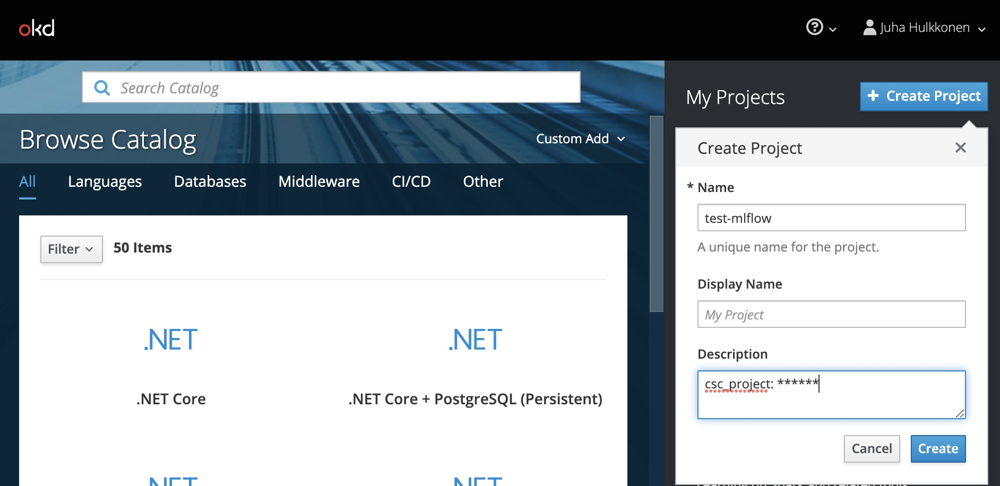
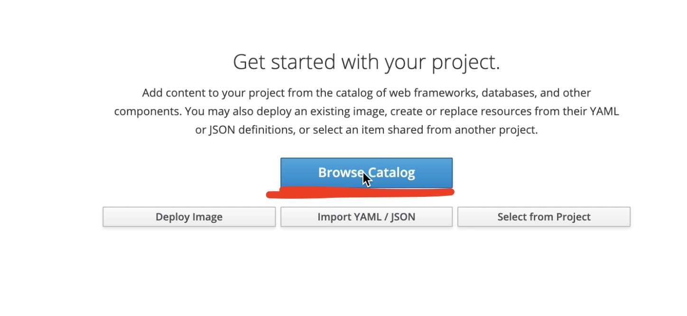
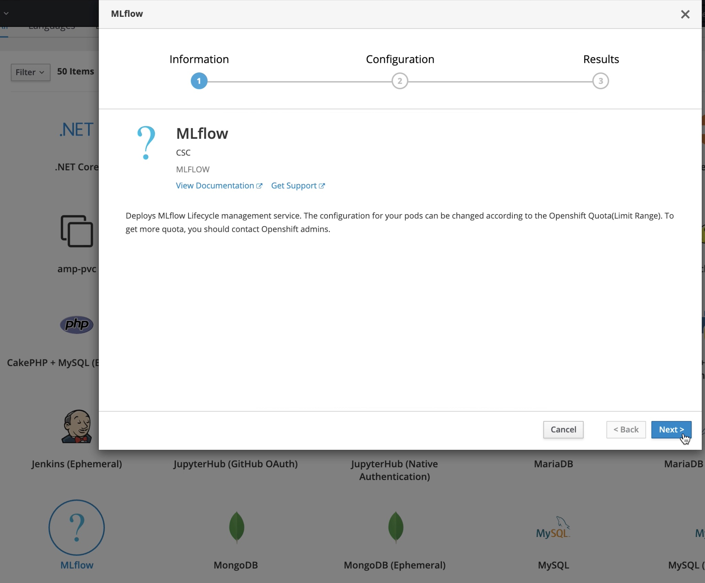
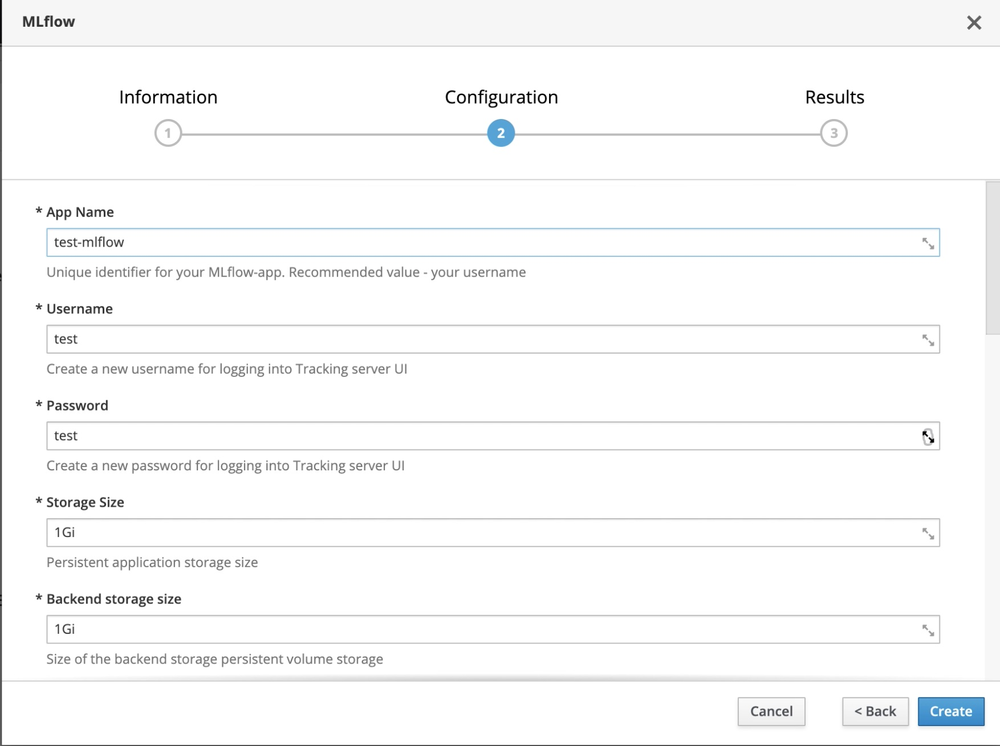

# MLflow user guide

## Contents
[Installation instructions](./USER_GUIDE.md#installation-instructions)

[Setting up Models](./USER_GUIDE.md#mlflow-models)

[Using Allas](./USER_GUIDE.md#using-csc-allas-as-artifact-store)

---
## Installation instructions ##

If you are unfamiliar with Rahti and how to get started, first check [Rahti's documentation](https://docs.csc.fi/cloud/rahti/)

Create new project by clicking *Create Project* and fill your project name and csc_project code


After you've created the project, *Browse catalog*


Find MLflow, click to choose it and click Next to start configuring your application


Fill the configuration form. Explanation and recommendations after the picture below


- App Name: You can define unique name for your MLflow instance. Name will be part of app public address.
- Username: Your self defined username for tracking server.
- Password: Your self defined password for tracking server.
- Storage Size: Storage size for MLflow persistent storage. Default should be enough.
- Backend storage size: Storage size for tracked metrics. Default should be enough.
- Object storage size: Storage size for tracked artifacts.
- Route whitelist: Add your static ip or ip range if you want to restrict access to your service.

For rest of the variables default is fine for most users.
- MLflow image: Latest tested image for Rahti as default value.
- Artifact store access key: Generated by template.
- Artifact store secret access key: Generated by template.
- PostgreSQL connection username: Generated by template.
- PostgreSQL connection password: Generated by template.
- PostgreSQL connection database: Generated by template.
- Application Hostname Suffix: Default is for Rahti.

After setting up all variables, click Create to start deployment. Summary window shows addresses for Tracking server and Models server.
Also generated keys for artifact store are shown here. Tracking server address, your credentials and artifact store keys should be added to your
machine learning development environment to send metrics and artifacts to MLflow.


**Congratulations!** After deployment is complete, you are ready to start using MLflow to track your machine learning training runs, compare models and to deploy best ones to inference.
There are simple test notebooks for tracking and inference in `examples` directory. [Example README](../examples/README.md)


## MLflow Models
MLflow Models is used to serve tracked model for inference. In the template, Models is run in own pod, so inference doesn't affect Tracking performance. 
Currently, template support serving one model at time.
### How to set up
First you have to have some training runs recorded to Tracking server with model as a artifact. Model have to be stored to default artifact store in MinIO, or in CSC Allas.

Open your experiment and your chosen run. Under artifacts there is model directory. When clicking that, Full Path of model uri can be copied. 


Add copied uri to `MODELS_URI` variable in `models-cfg` config map and save.


Increase `mlflow-models` pod count to 1.


Model can now be queried with http request. Copy your models pod address from Rahti and open example notebook.   from examples directory.


---

## Using CSC Allas as artifact store

For heavier use case it is recommended to use [CSC Allas](https://docs.csc.fi/data/Allas/) object storage service as artifact store.
To do that, you should have granted access to Allas and have access tokens available.

Create bucket for your mlflow-data via console tools or [Web UI](https://pouta.csc.fi)

You have to have [oc client](https://docs.csc.fi/cloud/rahti/usage/cli/) installed to you computer to modify secrets created by MLflow template.
Follow instructions to install `oc`, configure and connect it.

Download [mlflow-secret.yaml](https://github.com/CSCfi/mlflow-openshift/blob/master/mlflow-secret.yaml) file, save it locally and modify following lines:
```bash
  AWS_ACCESS_KEY_ID: your_access_key
  AWS_SECRET_ACCESS_KEY: your_secret_key
```
Save and use `oc` to modify existing secret in your Rahti MLflow namespace by commanding:
`oc apply -f ./mlflow-secret.yaml`

After that, edit `Resources -> Config Maps -> mlflow-cfg` and change `DEFAULT_ARTIFACT_ROOT` variable to `s3://your_bucket_name` and `MLFLOW_S3_ENDPOINT_URL`to `https://a3s.fi`

Restart mlflow-ui pod by scaling it first to zero, then back to one. Now when you create new experiment, default artifact store is your bucket in Allas.
